### Codegraph cục bộ

- Nguồn: 1845 tệp mã; 2800 liên kết import cục bộ.
- Hiển thị: 20/2800 liên kết theo thứ tự ổn định.
- Phạm vi: chỉ import resolve được trong project; package ngoài không được đưa vào context.

```mermaid
graph TD
  n_617070732f646f63732f6f75742f6d61696e2f696e6465782e6a73["apps/docs/out/main/index.js"] --> n_617070732f646f63732f6f75742f6d61696e2f7064662d42366c38465241352e6a73["apps/docs/out/main/pdf-B6l8FRA5.js"]
  n_617070732f646f63732f6f75742f6d61696e2f696e6465782e6a73["apps/docs/out/main/index.js"] --> n_617070732f646f63732f6f75742f6d61696e2f7064662e776f726b65722d4e423150425651482e6a73["apps/docs/out/main/pdf.worker-NB1PBVQH.js"]
  n_617070732f646f63732f7372632f6d61696e2f646f63732d6d61696e2e7473["apps/docs/src/main/docs-main.ts"] --> n_617070732f646f63732f7372632f6d61696e2f61746f6d69632d77726974652e7473["apps/docs/src/main/atomic-write.ts"]
  n_617070732f646f63732f7372632f6d61696e2f646f63732d6d61696e2e7473["apps/docs/src/main/docs-main.ts"] --> n_617070732f646f63732f7372632f6d61696e2f65787465726e616c2d6368616e67652e7473["apps/docs/src/main/external-change.ts"]
  n_617070732f646f63732f7372632f6d61696e2f646f63732d6d61696e2e7473["apps/docs/src/main/docs-main.ts"] --> n_617070732f646f63732f7372632f6d61696e2f757064617465722e7473["apps/docs/src/main/updater.ts"]
  n_617070732f646f63732f7372632f6d61696e2f646f63732d6d61696e2e7473["apps/docs/src/main/docs-main.ts"] --> n_617070732f646f63732f7372632f7368617265642f6970632e7473["apps/docs/src/shared/ipc.ts"]
  n_617070732f646f63732f7372632f6d61696e2f646f63732d6d61696e2e7473["apps/docs/src/main/docs-main.ts"] --> n_617070732f646f63732f7372632f7368617265642f6f70656e2d66696c652e7473["apps/docs/src/shared/open-file.ts"]
  n_617070732f646f63732f7372632f6d61696e2f696e6465782e7473["apps/docs/src/main/index.ts"] --> n_617070732f646f63732f7372632f6d61696e2f646f63732d6d61696e2e7473["apps/docs/src/main/docs-main.ts"]
  n_617070732f646f63732f7372632f7072656c6f61642f696e6465782e7473["apps/docs/src/preload/index.ts"] --> n_617070732f646f63732f7372632f7368617265642f6970632e7473["apps/docs/src/shared/ipc.ts"]
  n_617070732f646f63732f7372632f72656e64657265722f61692f416950616e656c2e747378["apps/docs/src/renderer/ai/AiPanel.tsx"] --> n_617070732f646f63732f7372632f72656e64657265722f61692f636f6e74696e756174696f6e2e7473["apps/docs/src/renderer/ai/continuation.ts"]
  n_617070732f646f63732f7372632f72656e64657265722f61692f416950616e656c2e747378["apps/docs/src/renderer/ai/AiPanel.tsx"] --> n_617070732f646f63732f7372632f72656e64657265722f61692f646f63732d736b696c6c2e7473["apps/docs/src/renderer/ai/docs-skill.ts"]
  n_617070732f646f63732f7372632f72656e64657265722f61692f416950616e656c2e747378["apps/docs/src/renderer/ai/AiPanel.tsx"] --> n_617070732f646f63732f7372632f72656e64657265722f61692f66696c65732d736b696c6c2e7473["apps/docs/src/renderer/ai/files-skill.ts"]
  n_617070732f646f63732f7372632f72656e64657265722f61692f416950616e656c2e747378["apps/docs/src/renderer/ai/AiPanel.tsx"] --> n_617070732f646f63732f7372632f72656e64657265722f61692f70726f746f636f6c2e7473["apps/docs/src/renderer/ai/protocol.ts"]
  n_617070732f646f63732f7372632f72656e64657265722f61692f416950616e656c2e747378["apps/docs/src/renderer/ai/AiPanel.tsx"] --> n_617070732f646f63732f7372632f72656e64657265722f61692f746f6f6c732e7473["apps/docs/src/renderer/ai/tools.ts"]
  n_617070732f646f63732f7372632f72656e64657265722f61692f416950616e656c2e747378["apps/docs/src/renderer/ai/AiPanel.tsx"] --> n_617070732f646f63732f7372632f72656e64657265722f61692f7472616e73706f72742e7473["apps/docs/src/renderer/ai/transport.ts"]
  n_617070732f646f63732f7372632f72656e64657265722f61692f416950616e656c2e747378["apps/docs/src/renderer/ai/AiPanel.tsx"] --> n_617070732f646f63732f7372632f72656e64657265722f636f6d706f6e656e74732f69636f6e732e747378["apps/docs/src/renderer/components/icons.tsx"]
  n_617070732f646f63732f7372632f72656e64657265722f61692f416950616e656c2e747378["apps/docs/src/renderer/ai/AiPanel.tsx"] --> n_617070732f646f63732f7372632f72656e64657265722f656469746f722f636f6e766572742e7473["apps/docs/src/renderer/editor/convert.ts"]
  n_617070732f646f63732f7372632f72656e64657265722f61692f416950616e656c2e747378["apps/docs/src/renderer/ai/AiPanel.tsx"] --> n_617070732f646f63732f7372632f72656e64657265722f656469746f722f7265766973696f6e732e7473["apps/docs/src/renderer/editor/revisions.ts"]
  n_617070732f646f63732f7372632f72656e64657265722f61692f416950616e656c2e747378["apps/docs/src/renderer/ai/AiPanel.tsx"] --> n_617070732f646f63732f7372632f72656e64657265722f6931386e2f6c6f63616c652e747378["apps/docs/src/renderer/i18n/locale.tsx"]
  n_617070732f646f63732f7372632f72656e64657265722f61692f416950616e656c2e747378["apps/docs/src/renderer/ai/AiPanel.tsx"] --> n_617070732f646f63732f7372632f7368617265642f6970632e7473["apps/docs/src/shared/ipc.ts"]
  more["… 2780 liên kết đã lược bỏ"]
```

