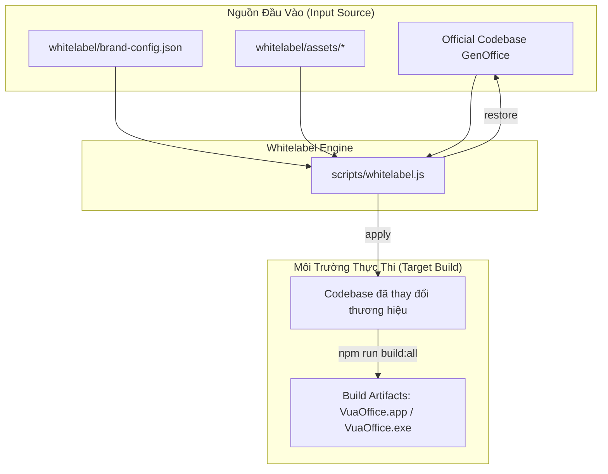
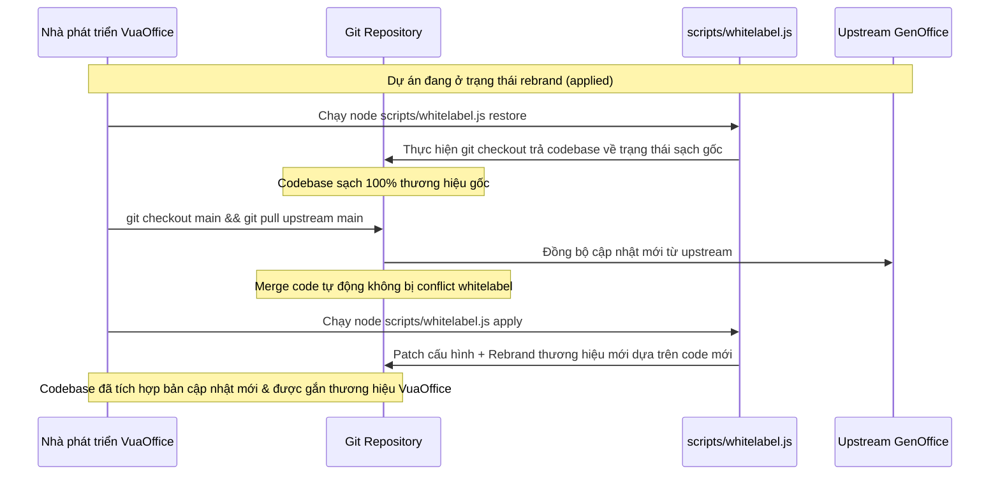

# ARCH.md — Kiến trúc Hệ thống Whitelabel VuaOffice

> Sinh từ [SPEC.md](SPEC.md) và [REQUIREMENTS.md](REQUIREMENTS.md).

Tài liệu này mô tả thiết kế kiến trúc và mô hình hoạt động của cơ chế Whitelabel (Branding & Rebranding Engine) cho dự án **VuaOffice**.

## 1. Sơ đồ Hoạt động Tổng quan (High-Level Architecture)

Hệ thống Whitelabel đóng vai trò là một lớp trung gian (Wrapper) chuyển đổi Codebase gốc của GenOffice thành VuaOffice trước khi chạy môi trường phát triển (Dev) hoặc đóng gói sản phẩm (Build/Distribute).

## 2. Chi tiết Luồng Git Workflow khi cập nhật Upstream

Để đảm bảo dự án không bị xung đột (conflict) code khi kéo bản cập nhật mới từ upstream repository (`genspark-ai/genoffice`), chúng ta sử dụng quy trình Git tích hợp với lệnh `restore` của Whitelabel CLI.

## 3. Các Thành phần Hệ thống (Core Components)

### 3.1 Whitelabel CLI Script (`scripts/whitelabel.js`)
- **Nhiệm vụ**: Thực thi việc vá file cấu hình, thay thế text strings bằng regex, sao chép file assets đồ họa và khôi phục trạng thái codebase qua git.
- **Đặc điểm**:
  - Không sử dụng thư viện ngoài (dependency-free) để chạy độc lập và cực kỳ nhanh.
  - Sử dụng module `fs` và `path` của NodeJS và shell command `git checkout` thông qua `child_process.execSync`.

### 3.2 Lớp Cấu hình Thương hiệu (`whitelabel/brand-config.json`)
- **Nhiệm vụ**: Chứa toàn bộ metadata, URL API và quy tắc thay thế text cho thương hiệu.
- **Đặc điểm**:
  - Dễ dàng thay đổi cấu hình mà không cần hiểu cấu trúc code.
  - Hỗ trợ Regex rule cho phép thay đổi linh hoạt các từ khóa ở nhiều file khác nhau.

### 3.3 Tích hợp AI Provider Gateway (`packages/ai-provider`)
- **Nhiệm vụ**: Định nghĩa các kênh phân phối request AI thông qua API gateway của 360 CORP (omirouter và 9router) tương thích với chuẩn OpenAPI.
- **Đặc điểm**:
  - Tách biệt logic API endpoint khỏi các ứng dụng client.
  - Cung cấp cơ chế tự động điền URL mặc định cho omirouter/9router nhưng vẫn cho phép user thay đổi Base URL qua giao diện cấu hình.

### 3.4 Module VuaMail (`apps/mail`)
- **Nhiệm vụ**: Cung cấp ứng dụng email client phong cách Microsoft Outlook tích hợp Mail Engine và AI Assistant trong bộ VuaOffice.
- **Đặc điểm**:
  - **Data Engine**: Kế thừa SQLite storage, offline op-queue và sync engine từ GenMail.
  - **UI Layer**: React 19 Fluent UI Ribbon 3 cột (AppRail/Folders, Message List, Reading/Compose Pane) chuẩn VuaOffice Theme Tokens.
  - **AI Integration**: Hỗ trợ tóm tắt chuỗi thư, phản hồi nhanh và tạo bản nháp qua `@genoffice/ai-provider`.

---

**Người viết:** Sếp (Product Owner) & Em (Architect)
**Trạng thái:** Approved
**Ngày duyệt:** 2026-08-15
