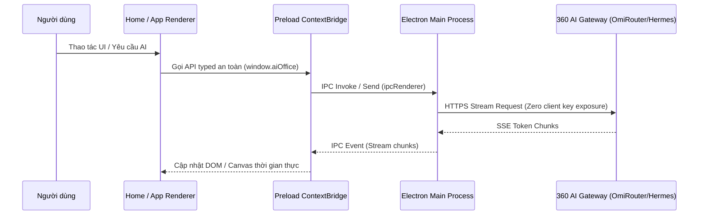

# ARCH.md — Kiến trúc Tổng thể Hệ thống VuaOffice

> **Tài liệu Kiến trúc Kỹ thuật (Technical Architecture Document)**  
> **Áp dụng cho**: Bộ ứng dụng VuaOffice Desktop Suite & Hạ tầng AI Gateway 360 CORP  
> **Phiên bản**: v0.6.7+

---

## 1. Sơ đồ Kiến trúc Tổng quan (High-Level Architecture)

VuaOffice được xây dựng trên mô hình **Monorepo Kiến trúc Đa Lớp (Multi-Layer Modular Architecture)** sử dụng npm workspaces, Electron 43, React 19, TypeScript 5.9 và Rust sidecar engine.

```mermaid
graph TD
    subgraph "Desktop Shell Layer (apps/shell)"
        MainProcess["Electron Main Process<br/>(tab-manager, updater, app-settings, menu)"]
        PreloadBridge["Preload ContextBridge<br/>(IPC API Channels, Security Isolation)"]
        HomeRenderer["Home Launcher & Settings<br/>(React 19, Semantic Tokens, Project Store)"]
    end

    subgraph "Application Suite Layer (apps/*)"
        DocsApp["apps/docs<br/>(Word/Docx Editor)"]
        SheetsApp["apps/sheets<br/>(Excel/Xlsx Engine)"]
        SlidesApp["apps/slides<br/>(PowerPoint/Pptx)"]
        PdfApp["apps/pdf<br/>(PDF Reader & Annotator)"]
        MdApp["apps/markdown<br/>(Tiptap GFM Notes)"]
        MailApp["apps/mail<br/>(VuaMail Client)"]
    end

    subgraph "Core Engine & Shared Libraries Layer (packages/*)"
        DocxEng["@genoffice/docx-engine<br/>(OpenXML Parser & Paging)"]
        PptxEng["@genoffice/pptx-engine<br/>(Slide Layout & Shapes)"]
        PptxRnd["@genoffice/pptx-render<br/>(HarfBuzz & Konva)"]
        FileParse["@genoffice/file-parse<br/>(Binary & Stream Parser)"]
        UiLib["@genoffice/ui<br/>(Semantic Tokens & Components)"]
        I18nLib["@genoffice/i18n<br/>(19 Languages Core)"]
        AgentCore["@genoffice/agent-core<br/>(Agentic Loop & Tools)"]
        AiProvider["@genoffice/ai-provider<br/>(OmiRouter, 9Router, Hermes)"]
    end

    subgraph "Whitelabel & Distribution Layer"
        BrandCfg["whitelabel/brand-config.json"]
        BrandScript["scripts/whitelabel.js"]
        CiBuild["GitHub Actions CI/CD<br/>(release.yml)"]
    end

    HomeRenderer --> PreloadBridge
    PreloadBridge --> MainProcess
    MainProcess --> DocsApp & SheetsApp & SlidesApp & PdfApp & MdApp & MailApp

    DocsApp --> DocxEng & UiLib & I18nLib & AiProvider & AgentCore
    SheetsApp --> UiLib & I18nLib & AiProvider & AgentCore
    SlidesApp --> PptxEng & PptxRnd & UiLib & I18nLib & AiProvider & AgentCore
    PdfApp --> FileParse & UiLib & I18nLib & AiProvider & AgentCore
    MdApp --> UiLib & I18nLib & AiProvider & AgentCore
    MailApp --> UiLib & I18nLib & AiProvider & AgentCore

    BrandCfg & BrandScript -.-> Desktop Shell Layer & Application Suite Layer
```

---

## 2. Kiến trúc Tiến trình Electron & Phân lập Bảo mật (IPC & Multi-Process Model)

VuaOffice thực thi nghiêm ngặt tiêu chuẩn bảo mật của Electron:
- **`contextIsolation: true`** và **`nodeIntegration: false`** trên tất cả các cửa sổ và tab view.
- **Tiến trình Shell (`apps/shell`)**: Đóng vai trò là Host chính, quản lý vòng đời ứng dụng, các menu hệ thống native, auto-updater và cấu hình.
- **Quản lý Tab View Đa tiến trình (`TabManager`)**: Mỗi tài liệu mở (Docs, Sheets, Slides, PDF, Markdown, Mail) chạy trên một `WebContentsView` độc lập. Sự cố sập tiến trình (renderer crash) ở một tài liệu không làm ảnh hưởng đến các tài liệu khác hoặc Shell chính.



---

## 3. Hạ tầng Trí tuệ Nhân tạo Đa tầng (AI Gateway & Provider Architecture)

Module `@genoffice/ai-provider` cung cấp cơ chế định tuyến linh hoạt:

1. **Mặc định (Production Mode)**: Kết nối tự động đến **OmiRouter AI** (`https://api.omirouter.com/v1`) hoặc **9Router AI** (`https://api.9router.com/v1`).
2. **Tác tử Thông minh (Agentic Workflows)**: Kết nối đến **Hermes Agent** (`https://hermes.vuahethong.com/v1`) hỗ trợ multi-step tool calls, tra cứu tài liệu và phân tích tự động.
3. **Chế độ Nhà phát triển (Developer Mode)**: Kích hoạt thông qua menu `Help > Troubleshooting > Enable Developer Mode`, cho phép cấu hình tùy biến Endpoint và Key (OpenAI, Anthropic, Gemini, DeepSeek, Local Ollama/vLLM).

---

## 4. Hệ thống Semantic Theme Tokens & Giao diện Doanh nghiệp

- **Hệ thống Tokens (`packages/ui/src/tokens.css`)**: Định nghĩa các biến CSS biến thiên theo chế độ Light, Dark và System:
  - Nền & Bề mặt: `var(--surface)`, `var(--surface-subtle)`, `var(--bg-hover)`, `var(--border)`
  - Văn bản: `var(--text)`, `var(--text-primary)`, `var(--text-muted)`
  - Màu thương hiệu (Accent): `--accent` và `--accent-dark` được kế thừa theo từng app con.
- **Nguyên tắc "Dark Chrome, White Paper"**: Giao diện điều khiển (Ribbon, Sidebar, Menu) thay đổi linh hoạt theo Theme hệ thống, trong khi vùng nội dung tài liệu (Trang giấy Docs, Ô bảng tính Sheets, Khung chiếu Slides, Trang PDF) giữ nguyên màu sắc tiêu chuẩn để đảm bảo tính toàn vẹn khi in ấn và xuất bản.

---

## 5. Hệ thống Thu thập Log & Diagnostic Report

Module `apps/shell/src/main/diagnostic-report.ts` chịu trách nhiệm thu thập và xử lý an toàn dữ liệu chẩn đoán:
- **Vùng đệm Log tròn (Circular Log Buffer)**: Lưu trữ 150 sự kiện log gần nhất trong phiên làm việc.
- **Engine Làm sạch Dữ liệu (Scrubber Engine)**:
  - Tự động thay thế đường dẫn thư mục người dùng (`/Users/...` ➜ `~`).
  - Lọc và thay thế toàn bộ Bearer Token, API Key, GitLab Token bằng `<redacted>`.
  - Làm mờ Email người dùng và địa chỉ IP cục bộ.
- **Cơ chế Gửi Báo cáo (GitLab Issues Dispatcher)**: Tự động tổng hợp dữ liệu thành định dạng Markdown chuẩn và gửi trực tiếp về hệ thống GitLab Issues (`360org/vuaoffice`).

---

## 6. Cơ chế Whitelabel & Quy trình Đồng bộ Upstream Tự động

Để giải quyết bài toán đồng bộ liên tục với upstream `genspark-ai/genoffice` mà không làm mất tùy biến của 360 CORP:

1. **Cấu hình Tập trung (`whitelabel/brand-config.json`)**: Định nghĩa toàn bộ chuỗi ký tự, URL Gateway, bundle ID và tài nguyên đồ họa.
2. **Whitelabel Script (`scripts/whitelabel.js`)**:
   - `apply`: Tự động vá cấu hình electron-builder, cập nhật package.json, đồng bộ logo/icon và áp dụng regex thay thế từ khóa.
   - `restore`: Sử dụng `git checkout` để hoàn tác mã nguồn về trạng thái sạch gốc trước khi thực hiện pull/merge.
3. **Quy trình Git Sync 2 Remote**:
   - **GitLab (`origin`)**: Lưu trữ private đầy đủ lịch sử phát triển.
   - **GitHub (`github`)**: Lưu trữ bản phân phối công khai, lọc tự động các file nhạy cảm theo `.githubignore` qua `git-sync-publish.sh`.

---

**Chủ quản**: 360 CORP  
**Trạng thái**: Đã phê duyệt (Approved)  
**Ngày cập nhật**: 2026-08-16
