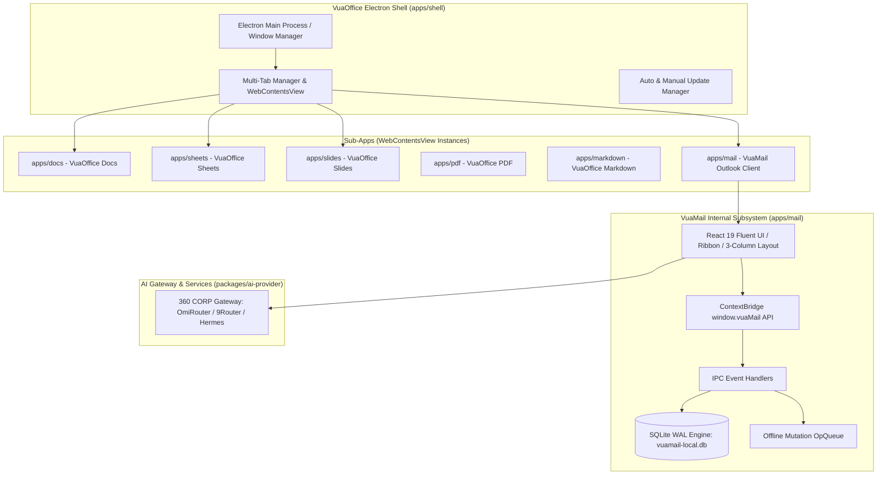
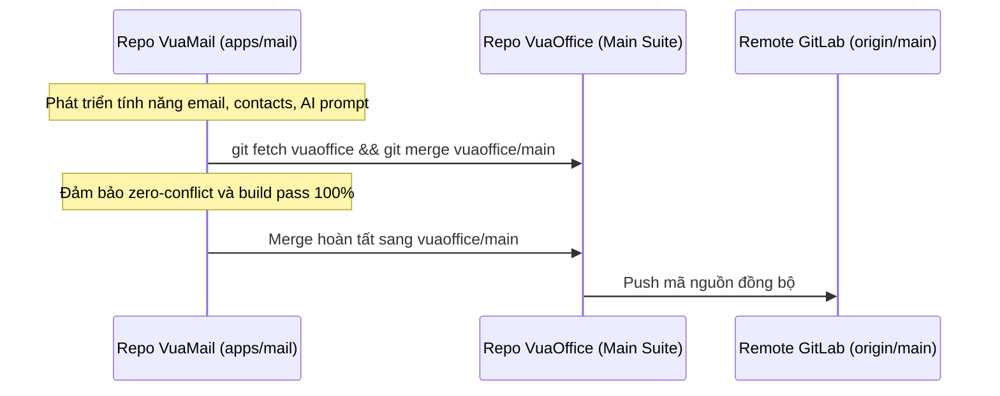

# ARCH.md — Kiến trúc Hệ thống VuaOffice & VuaMail Suite

> Sinh từ [SPEC.md](SPEC.md), [REQUIREMENTS.md](REQUIREMENTS.md) và [IDEA.md](IDEA.md).

Tài liệu này mô tả thiết kế kiến trúc toàn diện của **VuaOffice Suite** và module **VuaMail** (`apps/mail`), bao gồm mô hình tích hợp đa tiến trình Electron, luồng dữ liệu SQLite Offline Engine, và chiến lược phát triển song song không gây xung đột (Zero-Conflict Merge).

---

## 1. Sơ đồ Kiến trúc Tổng thể (High-Level Architecture)

VuaOffice hoạt động theo mô hình Monorepo chứa Electron Shell đa tab (`apps/shell`), kết hợp nhiều ứng dụng con chạy qua `WebContentsView`.

---

## 2. Chiến lược Phát triển Song song & Quy trình Zero-Conflict Merge

Để phát triển VuaMail đồng thời với VuaOffice mà không gây xung đột:

1. **Cô lập Module (Module Isolation)**:
   - Toàn bộ code logic, components, DB storage, và build configs của VuaMail nằm hoàn toàn độc lập trong thư mục `/Volumes/DATA/DEV/VuaMail/apps/mail/`.
   - VuaMail chỉ tương tác với Shell thông qua hợp đồng chuẩn: `initMailBackend()` & `createMailView()` tại `apps/mail/src/main/mail-main.ts`.
2. **Quy trình Git Sync Song song**:
   - `VuaMail` kết nối remote nội bộ tới repository `vuaoffice` (`git remote add vuaoffice /Volumes/DATA/DEV/vuaoffice`).
   - Trước khi merge hoặc phát hành tính năng mới, nhánh `VuaMail` luôn fetch và rebase/merge từ `vuaoffice/main`.
   - Các tài liệu chuẩn (`CHANGELOGS.md`, `ARCH.md`, `SPEC.md`, `REQUIREMENTS.md`, `ROADMAP.md`, `TASKS.md`) được cập nhật đồng bộ.

---

## 3. Chi tiết Thành phần Module VuaMail (`apps/mail`)

### 3.1 Giao diện Người dùng (React 19 Fluent UI)
- **AppRail**: Điều hướng dọc (Mail, Calendar, Contacts, To-Do).
- **FolderTree**: Cây thư mục hộp thư phân loại Favorites và Folders cá nhân.
- **MailList**: Danh sách email hỗ trợ lọc thông minh *Focused* và *Other*, tìm kiếm tức thì.
- **ReadingPane**: Trình đọc email chuẩn rich-text, danh sách tệp đính kèm kèm xem trước, và khung **AI Smart Summary**.
- **ComposeModal**: Cửa sổ soạn thư đa năng tích hợp AI Smart Draft.

### 3.2 Bộ nhớ Dữ liệu Cục bộ (SQLite Storage Engine)
- Sử dụng thư viện `better-sqlite3` chạy ở chế độ **WAL (Write-Ahead Logging)** cho tốc độ I/O tối đa.
- Cơ chế lazy-loading: Tiêu đề và trích đoạn nạp vào danh sách trước; nội dung HTML/text được nạp khi nhấp chọn thư.
- **OpQueue**: Lưu trữ các thao tác (đọc, xoá, di chuyển, gắn cờ, gửi thư nháp) khi ngoại tuyến và tự động phát lại khi có mạng.

---

**Người viết:** Sếp (Product Owner) & Em (Architect)
**Trạng thái:** Approved
**Ngày cập nhật:** 2026-08-15
