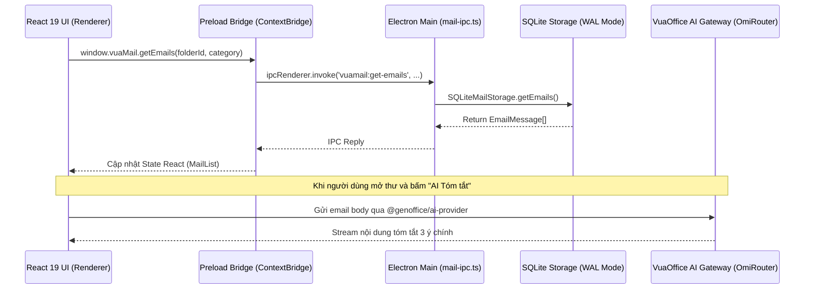

# VuaMail Codebase Map & Module Architecture

> **Phạm vi tài liệu**: Bản đồ mã nguồn chi tiết cho module `apps/mail` (@genoffice/mail) và tương tác với VuaOffice Suite.  
> **Đường dẫn module**: `/Volumes/DATA/DEV/VuaMail/apps/mail`  
> **Cập nhật ngày**: 2026-08-15  

---

## 1. Tổng quan Kiến trúc Thư mục

```
/Volumes/DATA/DEV/VuaMail/apps/mail/
├── electron.vite.config.ts          # Cấu hình đóng gói Electron Vite (Main, Preload, Renderer)
├── vite.renderer.config.ts          # Cấu hình Vite chạy độc lập cho UI Renderer
├── package.json                     # Định nghĩa module @genoffice/mail (version 0.6.6)
├── tsconfig.json                    # Cấu hình TypeScript Strict Mode
│
├── src/
│   ├── main/                        # Node.js / Electron Main Process (Backend)
│   │   ├── index.ts                 # Điểm khởi chạy Standalone Dev Window
│   │   ├── mail-main.ts             # Export API `initMailBackend()` & `createMailView()` cho Shell đa tab
│   │   ├── db/
│   │   │   ├── schema.ts            # Định nghĩa bảng SQLite (accounts, folders, emails, bodies, op_queue)
│   │   │   └── sqlite-storage.ts    # DAO & Data Engine xử lý truy vấn SQLite, seed demo data, OpQueue
│   │   └── ipc/
│   │       └── mail-ipc.ts          # Đăng ký IPC handlers (ipcMain.handle) nhận lệnh từ renderer
│   │
│   ├── preload/                     # Electron Preload Bridge
│   │   └── index.ts                 # ContextBridge phơi đối tượng `window.vuaMail` an toàn
│   │
│   ├── shared/                      # Types & Constants dùng chung giữa Main và Renderer
│   │   ├── types.ts                 # Interface: EmailMessage, EmailBody, MailFolder, ContactInfo, VuaMailApi
│   │   └── ipc-events.ts            # Hằng số IPC Event Names (VUA_MAIL_IPC)
│   │
│   └── renderer/                    # React 19 + Fluent UI UI Layer (Frontend)
│       ├── index.html               # Entry HTML shell
│       └── src/
│           ├── main.tsx             # React Mount point (ReactDOM.createRoot)
│           ├── App.tsx              # Component tổng hợp bố cục 3 cột Outlook
│           ├── styles/
│           │   └── mail-theme.css   # Mapping Semantic Design Tokens và Fluent UI CSS
│           └── components/
│               ├── ribbon/          # Thanh Ribbon trên cùng
│               │   ├── MailRibbon.tsx
│               │   └── RibbonButton.tsx
│               ├── sidebar/         # Cột 1: AppRail (Mail/Calendar/People/Todo) & FolderTree
│               │   ├── AppRail.tsx
│               │   └── FolderTree.tsx
│               ├── list/            # Cột 2: Danh sách thư (Focused / Other)
│               │   └── MailList.tsx
│               ├── detail/          # Cột 3: Khung xem thư chi tiết & AI Smart Summary
│               │   └── ReadingPane.tsx
│               └── compose/         # Hộp thoại soạn thư & AI Draft Assist
│                   └── ComposeModal.tsx
```

---

## 2. Bản đồ Luồng Dữ liệu (Data Flow & IPC Bridge)



---

## 3. Danh mục API Bridge (`window.vuaMail`)

| Hàm API | IPC Channel | Mục đích |
|---|---|---|
| `getAccounts()` | `vuamail:get-accounts` | Lấy danh sách tài khoản email kết nối trong máy |
| `getFolders(accountId)` | `vuamail:get-folders` | Lấy danh sách thư mục (Inbox, Sent, Drafts, Archive, Trash...) |
| `getEmails(folderId, cat)` | `vuamail:get-emails` | Lấy danh sách email theo thư mục và tab Focused / Other |
| `getEmailBody(emailId)` | `vuamail:get-email-body` | Lazy-load nội dung HTML & Text của email |
| `markRead(emailId, isRead)` | `vuamail:mark-read` | Đánh dấu đã đọc / chưa đọc |
| `toggleStarred(emailId)` | `vuamail:toggle-starred` | Bật/tắt gắn cờ / gắn sao email quan trọng |
| `deleteEmail(emailId)` | `vuamail:delete-email` | Xoá email vào thùng rác |
| `archiveEmail(emailId)` | `vuamail:archive-email` | Lưu trữ email vào thư mục Archive |
| `sendEmail(draft)` | `vuamail:send-email` | Gửi email mới / lưu vào Sent Items |
